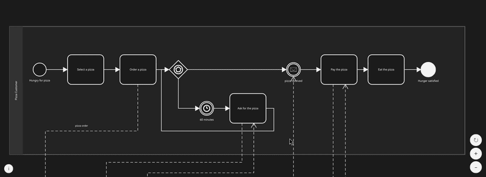
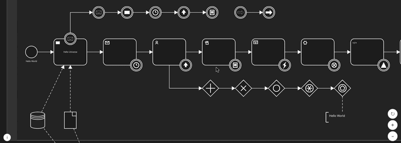
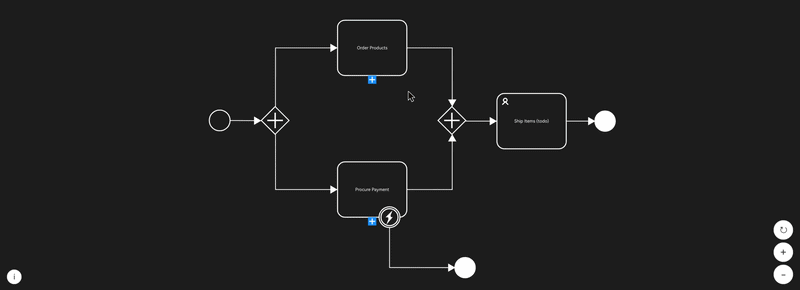
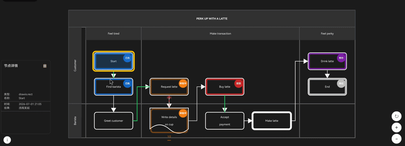

# hmflowkit

鸿蒙原生流程图引擎，支持 BPMN、drawio 格式。纯 ArkTS + Canvas 2D 实现，零第三方依赖。

## 演示

<table>
  <tr>
    <td></td>
    <td></td>
  </tr>
  <tr>
    <td></td>
    <td></td>
  </tr>
</table>

## 安装

```bash
ohpm install hmflowkit
```


## 功能

| BPMN | drawio | 共用基础 |
|------|--------|----------|
| BPMN 2.0 XML 解析（兼容 bpmn.js） | mxGraph XML 解析 + HTML 净化 | 纯 ArkTS Canvas 2D 渲染，无 WebView |
| 4 类 Gateway 内部标记（X / + / ○ / ◇） | BPMN 2.0 形状全映射（Event / Gateway / Task） | 命中检测（HitTest），嵌套元素最小面积优先 |
| 10 种 EventDefinition 图标 | 跨职能流程图（swimlane / tableRow） | 系统明暗主题自动适配 + RenderConfig 自定义配色 |
| 7 种 Task 类型图标 + callActivity | drawio 容器形状（table / tableRow / swimlane） | 画布自动适配（auto-fit）+ 拖拽平移 + 双指缩放 |
| Pool/Lane 泳池泳道（嵌套 Lane + 横向/纵向） | document 波浪底边、process 粗边框 | 画布四向旋转（0°/90°/180°/270°） |
| 3 种 SubProcess 边框（单线/双线/虚线） | bezier 曲线 + 起止箭头（endArrow/startArrow） | GraphModel 不可变数据模型 + PlaneHierarchy 层级管理 |
| SequenceFlow、MessageFlow、Association | 多页 drawio diagram 支持 | 数据驱动形状几何（ShapeDefinition + PerimeterRouter + PathRenderer） |
| 多平面钻取导航（展开/折叠 + 面包屑） | per-edge 颜色 / 虚线样式 | INodeDrawer 扩展接口 + ShapeConfig 跨格式注册表 |
| — | — | 调试侧边栏（7 区段可折叠面板，含时间线/性能/统计） |
| — | — | **审批流状态可视化**：节点内边框+角标、流转路径四态染色、会签进度、脉冲动画、浮动信息面板、可插拔适配器 |
| — | — | 255 项自动化单元测试，鸿蒙 PC + 移动端通用，兼容 HarmonyOS 5.0+

## 快速开始

```typescript
import { FlowViewer } from 'hmflowkit'

// 渲染 BPMN 流程图
FlowViewer({ xml: this.bpmnXmlString })

// 渲染 drawio 流程图
FlowViewer({ drawioXml: this.drawioXmlStr })

// 渲染 + 审批流状态覆盖
FlowViewer({
  xml: this.bpmnXmlString,
  nodeStatuses: this.statusMap,
  edgeTrails: this.trails,
  approvalConfig: this.config
})
```

## 核心 API

### FlowViewer

唯一入口组件，一行接入。

| 参数 | 类型 | 默认值 | 说明 |
|------|------|--------|------|
| xml | string | '' | BPMN XML 字符串（自动解析 + 钻取检测） |
| drawioXml | string | '' | drawio mxGraph XML 字符串 |
| model | GraphModel | 空模型 | 编程构建场景 |
| canvasHeight | number | 600 | 画布高度 |
| showGrid | boolean | false | 背景网格 |
| renderConfig | RenderConfig | 默认配置 | 自定义配色 |
| nodeStatuses | NodeStatusMap | 空 | 节点审批状态（启用审批覆盖层） |
| edgeTrails | EdgeTrail[] | [] | 流转路径轨迹 |
| approvalConfig | ApprovalOverlayConfig | 默认 | 审批覆盖层视觉参数 |
| approvalColorPreset | PresetId | 'CLASSIC' | 配色预设（CLASSIC/GOVERNMENT/DARK） |
| onNodeClick | (nodeId: string) => void | — | 节点点击回调 |
| onCanvasReady | () => void | — | 画布就绪回调 |
| onNodeDecorator | OnNodeDecorator | — | 自定义节点装饰回调 |

### RenderConfig

所有颜色、字体、间距均可配置。默认跟随系统明暗主题。需在 `EntryAbility` 中写入 AppStorage：

```typescript
// EntryAbility
onCreate(want, launchParam) {
  AppStorage.setOrCreate('currentColorMode', this.context.config.colorMode);
}
onConfigurationUpdate(newConfig) {
  AppStorage.setOrCreate('currentColorMode', newConfig.colorMode);
}
```

传 `renderConfig` 可覆盖默认配色，此时不受系统主题切换影响：

```typescript
let config = new RenderConfig()
config.fillColor = '#F0F0F0'
FlowViewer({ xml: this.bpmnXml, renderConfig: config })
```

### BpmnXmlParser

```typescript
BpmnXmlParser.parse(xml: string): GraphModel                // 严格解析
BpmnXmlParser.parseBestEffort(xml: string): ParseResult      // 宽松解析（遇错保留已有数据）
BpmnXmlParser.parseHierarchy(xml: string): PlaneHierarchy    // 多平面层级
```

### DrawioXmlParser

```typescript
DrawioXmlParser.parse(xml: string): DrawioParseResult      // mxGraph XML → GraphModel + 元数据
// DrawioParseResult { model, meta }
// DrawioParseMeta: diagrams[], pageCount, styleParseStats
```

### DrawioStyleParser

```typescript
DrawioStyleParser.parse(style: string): DrawioStyle         // style 字符串 → 形状类型 + 属性
// DrawioStyle { shapeType, fillColor, strokeColor, strokeWidth, ... }
```

### INodeDrawer（扩展接口）

```typescript
interface INodeDrawer {
  draw(ctx, node, config, offsetX, offsetY, zoom): void
}
NodeRenderer.register('myShape', myDrawer)  // 用户可注册自定义形状
```

### 审批流状态可视化 (Approval)

```typescript
// 数据模型
new NodeStatus(nodeId, status, operator, avatar, timestamp, comment, result)
new EdgeTrail(edgeId, kind, label, timestamp, operator)  // kind: active|rejected|historical|skipped
new ApprovalOverlayConfig()  // 内边框、角标、脉冲、气泡面板参数

// 适配器接口（接自有审批系统）
interface IApprovalAdapter {
  getNodeStatus(nodeId: string): NodeStatus | null
  getEdgeTrails(): EdgeTrail[]
}

// 内置适配器
new FlowableHistoryAdapter(historyEntries)  // Flowable 引擎 → 状态贴图

// 配色预设
ApprovalColorPresets.CLASSIC     // 琥珀(审批中) + 蓝(已批) + 红(驳回)
ApprovalColorPresets.GOVERNMENT  // 红蓝灰政务风格
ApprovalColorPresets.DARK        // 暗色适配
```

### GraphModel

不可变数据模型。所有写操作返回新实例。

```typescript
GraphModel.createEmpty(): GraphModel
// 节点
addNode(node): GraphModel        removeNode(id): GraphModel
moveNode(id, x, y): GraphModel   getNode(id): GraphNode | null
getNodes(): GraphNode[]
// 边
addEdge(edge): GraphModel        removeEdge(id): GraphModel
getEdge(id): GraphEdge | null    getEdges(): GraphEdge[]
// Pool / Lane
addPool(pool): GraphModel        removePool(id): GraphModel
getPools(): Pool[]               getLaneByNode(nodeId): Lane | null
// 序列化
toJSON(): GraphModelSnapshot     static fromJSON(s): GraphModel
```

## 协议

Apache-2.0

## 仓库

https://github.com/liz7up/hm_flow_kit

本项目为开源项目（Apache-2.0），欢迎提交 Issue 和 PR。

